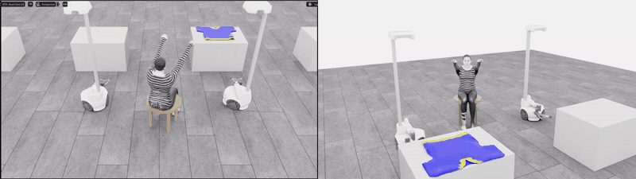
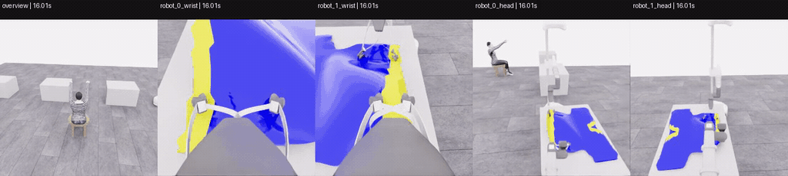
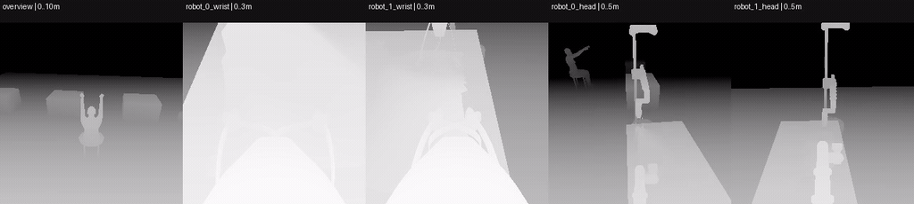

# PhyRC 2027 · Phase 1 참가자 가이드

두 대의 **Stretch4 로봇**으로 마네킹에게 티셔츠를 입히는 Isaac Sim 6.0.1 환경입니다.
참가자는 키보드로 로봇을 직접 조종하는 **teleop**으로 시연을 수집합니다.
이 시연으로 **카메라 영상·로봇 상태를 보고 다음 동작을 결정하는 정책(학습 모델)**을 학습하고,
정책이 **로봇마다 9개씩, 두 로봇에 총 18개의 제어 명령**을 보내도록 실행합니다.
이 `competition` 브랜치는 참가자용 설치·수집·정책 실행·평가 안내를 제공합니다.

[용어·배열 표기](docs/competition/GLOSSARY.md) · [설치](docs/competition/SETUP.md) · [데이터·CSV 열 설명](docs/competition/DATA.md) · [정책 실행](docs/competition/POLICY.md) · [평가](docs/competition/EVALUATION.md) · [참가 규칙](docs/competition/RULES.md) · [실제 데이터 예제](docs/examples/teleop/README.md)

## Teleop 동작 예시



수집 중 teleop 화면과 마네킹 정면 화면을 동기화한 **32배속** 예시입니다.
README에서는 GIF가 직접 재생됩니다. [전체 MP4](docs/videos/Back_Front_32x.mp4)로 더 선명하게 볼 수 있습니다.
이 시연 영상과 아래 학습 데이터 예제는 서로 다른 실행입니다. 영상 배속은 정책 주기나 평가 시간을 바꾸지 않습니다.

## 1. 설치하고 실행하기

**Linux x86-64 + NVIDIA RTX GPU + Docker + NVIDIA Container Toolkit**을 사용합니다.
호스트에 Isaac Sim, ROS, Conda 또는 별도의 CUDA Toolkit을 설치할 필요는 없습니다.
준비부터 확인까지의 명령은 [설치 가이드](docs/competition/SETUP.md)에 있습니다.
새 체크아웃에서 확인한 [검증 결과와 범위](docs/competition/VERIFICATION.md)도 참고하세요.

Docker의 GPU 접근이 준비됐다면:

```bash
git clone --branch competition --single-branch \
  https://github.com/0x4A656F6E2053656F79756C/PhyRC_2027.git
cd PhyRC_2027
./run.sh doctor
./run.sh build
./run.sh prepare
./run.sh smoke
./run.sh gui
```

NVIDIA 컨테이너의 라이선스·개인정보 관련 실행 옵션은 실행기가 전달합니다.
별도의 `PHYRC_ACCEPT_EULA` 환경 변수는 필요하지 않습니다.
사용 전 [NVIDIA 이용 조건과 설치 안내](https://docs.isaacsim.omniverse.nvidia.com/6.0.1/installation/install_container.html) 및 [자산 출처](THIRD_PARTY.md)를 확인하세요.

## 2. Teleop 조종

Isaac Sim 창의 3D 장면 영역(viewport)을 클릭해 키보드 초점을 둡니다. 로봇 번호는 데이터 기준 **robot_0 / robot_1**입니다.
두 로봇을 동시에 조종할 수 있습니다. 로봇 1 조종에는 숫자 키패드가 필요합니다.

| 조작 | robot_0 | robot_1 |
|---|---|---|
| 전진 / 후진 | `I` / `K` | `↑` / `↓` |
| 왼쪽 / 오른쪽 이동 | `J` / `L` | `←` / `→` |
| 베이스 회전 + / − | `U` / `O` | 키패드 `/` / `*` |
| 리프트 상승 / 하강 | `W` / `S` | 키패드 `8` / `2` |
| 팔 신장 / 수축 | `D` / `A` | 키패드 `6` / `4` |
| 손목 yaw + / − | `E` / `Q` | 키패드 `9` / `7` |
| 손목 pitch + / − | `V` / `R` | 키패드 `+` / `-` |
| 손목 roll + / − | `C` / `Z` | 키패드 `3` / `1` |
| 그리퍼 개폐 전환 | `Space` 또는 상단 `0` | 키패드 `0` 또는 `Enter` |
| 장면 초기화 | `P` | 공통 |
| 정상 종료·자동 저장 | `ESC` | 공통 |

충돌 메시 표시는 기본적으로 꺼져 있습니다. 물리 충돌 계산은 계속 동작합니다.
PC가 느리면 실제 조작 시간보다 시뮬레이션 시간이 느리게 흐를 수 있습니다.
정책 데이터의 시간과 채점은 **시뮬레이션 시간**을 사용합니다.

## 3. 학습 데이터 수집하기

```bash
./run.sh gui --training-record 1
```

1. 시작하면 자동으로 기록합니다. 별도의 기록 시작 키는 필요 없습니다.
2. teleop으로 시연한 뒤 **Isaac Sim 창에서 `ESC`**를 누릅니다.
3. 창이 닫힌 뒤 자동으로 RGB-D와 HDF5를 생성합니다. **터미널을 닫지 말고 `[Dataset export] READY ...`까지 기다립니다.**

> [!IMPORTANT]
> **ESC를 누른 뒤에도 데이터 저장 작업은 계속됩니다.** Isaac Sim 창이 닫혀도 완료된 것이 아닙니다.
> 기본 학습 기록 모드에서는 종료 후 카메라 이미지와 학습용 HDF5를 생성합니다.
> **실행한 터미널을 닫거나 `Ctrl+C`로 중단하지 말고, `[Dataset export] READY ...`가 출력될 때까지 기다려 주세요.**
> 기록 길이와 PC 성능에 따라 시간이 걸릴 수 있습니다. 중간에 종료하면 학습 파일 생성이 완료되지 않을 수 있습니다.
> READY를 확인한 뒤 터미널을 닫으면 됩니다.

| 목적 | 명령 |
|---|---|
| 조종 연습 | `./run.sh gui` |
| 학습용 데이터 수집 | `./run.sh gui --training-record 1` |
| 시작부터 화면을 보며 자동 평가 | `./run.sh gui --evaluate 1` |
| 학습용 수집 + 조종 중 자동 평가 | `./run.sh gui --training-record 1 --evaluate 1` |
| 원본 상태 기록만 수집 | `./run.sh gui --full-record 1` |
| 고정 초기 배치로 조종 연습 | `./run.sh gui --no-randomization` |

`--training-record 1`은 전체 원본 기록도 자동으로 켭니다. 기본 모드는 조종 후 이미지를 생성해 조종 중 부하를 줄입니다.
실시간으로 HDF5를 만드는 모드는 `--training-render live`이며 렌더링 부하가 더 큽니다.
학습 기록은 평가 결과도 자동 저장합니다. `--evaluate 1`을 추가하면 기본 수집 모드에서도 조종 중 점수 변화를 볼 수 있습니다.
이때 실시간 평가와 이미지 변환 후 평가 결과가 각각 저장됩니다.

```text
output/
  full_teleop/<실행ID>/          원본 상태·입력 기록: 재현·검증용
  policy_datasets/<실행ID>/
    policy.hdf5                정책 학습용 관측·액션
    audit.hdf5                 검증용 상태·화면·점수: 정책 입력 금지
    capture.json               수집/변환 완료 여부
    evaluation/                에피소드별 평가 결과
  evaluation/teleop/<평가ID>/   --evaluate 1의 실시간 평가 결과
```

`P`는 에피소드를 나눕니다. 창 강제 종료·프로세스 종료로 `complete=false`가 되면 학습 로더가 거부합니다.
미완료 파일을 정상 파일처럼 표시해 사용하지 마세요. 정상 수집 후 변환만 중단됐다면 [변환 재시도](docs/competition/DATA.md#변환-재시도와-검사)를 사용할 수 있습니다.

## 4. 취득할 수 있는 관측

기본 정책 주기는 **20Hz**, 내부 제어는 **60Hz**, 물리는 **240Hz**입니다.
여기서 Hz는 시뮬레이션 1초당 처리 횟수로, 20Hz는 0.05초마다 한 번 명령을 선택한다는 뜻입니다.
한 action을 0.05초 동안, 즉 제어 3회·물리 12회에 걸쳐 유지합니다.
`obs[t] → action[t] → next_obs[t]` 순서로 저장하며 카메라와 로봇 상태의 시뮬레이션 시각을 맞춥니다.

| 데이터 | 실행 시 배열 크기(shape) | 의미 |
|---|---|---|
| RGB | `(5,256,256,3)` | 외부1 + 두 로봇의 손목2·상단2, uint8 RGB |
| Depth / 유효 mask | 각각 `(5,256,256,1)` | 광학 Z 거리(m), float32 / bool. 무효 깊이는0 |
| 관절 위치·속도 | 각각 `(2,13)` | 관절별 m 또는 rad / m/s 또는 rad/s |
| 로봇 베이스 자세 | `(2,7)` | 월드 xyz(m) + quaternion wxyz |
| 로봇 베이스 속도 | `(2,6)` | 월드 선속도 xyz + 각속도 xyz |
| 그리퍼 자세 | `(2,7)` | 로봇 base 기준 xyz + quaternion wxyz |
| 손끝 위치·원점 간 거리 | `(2,2,3)`, `(2,1)` | base 기준 링크 원점, m |
| 제어 목표 | `(2,9)` | 현재 제어 목표값, 측정 위치와 구분 |
| 그리퍼 닫힘 의도 | `(2,1)` | bool. 잡기 성공 여부가 아님 |
| 직전 action | `(2,9)` | 직전 구간의 정규화 명령 |
| 시뮬레이션 시각 | scalar(숫자 하나) | 초 |

정확한 키·열 순서·단위는 [데이터 가이드](docs/competition/DATA.md)와 [공개 명세](config/policy_interface.json)에 있습니다.
**위 관측과 아래 action만 학습·추론에 사용합니다.**

### 실제 RGB-D 예시



왼쪽부터 **외부 → 로봇0 손목 → 로봇1 손목 → 로봇0 상단 → 로봇1 상단**입니다.
아래 링크로 각 카메라의 전체 예시 MP4를 볼 수 있습니다.

[외부](docs/videos/sample_overview.mp4) · [로봇0 손목](docs/videos/sample_robot_0_wrist.mp4) · [로봇1 손목](docs/videos/sample_robot_1_wrist.mp4) · [로봇0 상단](docs/videos/sample_robot_0_head.mp4) · [로봇1 상단](docs/videos/sample_robot_1_head.mp4) · [5개 RGB 모음](docs/videos/sample_all_cameras_rgb.mp4)



[전체 depth MP4](docs/videos/sample_all_cameras_depth.mp4). 밝을수록 가까우며 카메라별 표시된 범위를 사용합니다.
검정은 무효 또는 최대거리 부근이므로 학습에서는 `depth_valid`를 함께 사용하세요.
GIF는 일부 구간, MP4는 5fps 미리보기입니다. 원본은 20Hz이며 영상 압축·미리보기 생략은 학습 HDF5에 적용하지 않았습니다.

예제 데이터는 **1,142개 학습 구간(전이), 시뮬레이션 시간 57.1초**의 실제 수집이며 관측·액션·카메라 동기화 검사를 통과했습니다.
집기5점만 획득한 부분 시연으로, 성공 정책이나 성공 시연 예제가 아닙니다.
[CSV 및 열람 페이지](docs/examples/teleop/README.md)에서 자세히 확인할 수 있습니다.

## 5. Action과 숫자의 의미

**`(2,9)`는 “로봇 2대 × 로봇마다 명령 9개”를 담는 배열 크기입니다.**
첫 행은 robot_0, 두 번째 행은 robot_1의 명령입니다. 각 행의 9개 열은 아래 표의 명령에 대응합니다.

```text
             전진  왼쪽  베이스회전  리프트  팔신장  손목yaw  pitch  roll  그리퍼
robot_0:     [ 0,    0,       0,       1,      0,       0,     0,    0,     0 ]
robot_1:     [ 0,    0,       0,       0,      0,       0,     0,    0,     0 ]
```

위 예시는 robot_0 리프트에 상승 명령을 보내고, 다른 이동·회전 축에는 구동 명령을 보내지 않는 경우입니다.
그리퍼 0은 이전 개폐 의도를 유지합니다. Python에서는 `action[0,3] = 1`에 해당합니다(인덱스는 0부터 시작).

명령은 `float32`(소수도 표현할 수 있는 32비트 숫자)이고 허용 범위는 **−1 이상 +1 이하**입니다.
저장할 때는 두 행을 이어 붙여 길이 18의 목록 `(18,)`으로 만듭니다.
여러 시점의 명령을 쌓은 `(N,18)`에서 `N`은 action 구간 수입니다. 예제의 N은 1,142입니다.

| 로봇당 열 | 명령 | 양의 방향 / 값의 의미 |
|---|---|---|
| 0 | base_forward_velocity | 전진 |
| 1 | base_left_velocity | 로봇 왼쪽 |
| 2 | base_yaw_velocity | 베이스 +Z 반시계 회전 |
| 3 | lift_velocity | 리프트 상승 |
| 4 | arm_extension_velocity | 팔 신장 |
| 5–7 | wrist_yaw / pitch / roll_velocity | 해당 관절의 양의 회전 |
| 8 | gripper_command | +1 닫기, −1 열기, 0 이전 개폐 의도 유지 |

키보드 시연의 이동·회전 값은 **+1=양의 방향 구동, −1=음의 방향 구동, 0=구동 명령 없음**입니다.
키를 누르는 방식이라 `−1,0,1`만 나오는 것이 정상입니다. 정책은 `0.3` 등 중간값도 출력할 수 있습니다.
`lift_velocity=1`은 **1m/s가 아니라 설정된 리프트 속도 스케일의100%를 요청**한다는 뜻입니다.
실제 위치·속도는 관측에 따로 있으며, 물리·관절 제한 때문에 요청값과 다를 수 있습니다.
그리퍼 0은 열기가 아니라 **이전 의도 유지**입니다. 닫힘 요청은 매 프레임 반복되지 않습니다.

[실제 actions CSV](docs/examples/teleop/demo_0_actions.csv) · [obs CSV](docs/examples/teleop/demo_0_obs.csv) · [next_obs CSV](docs/examples/teleop/demo_0_next_obs.csv) · [모든 CSV 열의 의미](docs/examples/teleop/columns.csv)

CSV 한 행은 하나의0.05초 action 구간입니다. `obs`는 구간 직전, `next_obs`는 구간 직후입니다.
CSV의 `[i]`는 배열을 로봇 순서대로 펼친 인덱스입니다. 예를 들어 `joint_position[13]`은 robot_1의 첫 관절입니다.
[데이터 가이드](docs/competition/DATA.md)에 각 필드·인덱스·물리 단위와 실제 값 예시를 설명했습니다.

## 6. 정책 학습과 실행

`policy.hdf5`는 robomimic 스타일의 `data/demo_N/{obs,next_obs,actions,rewards,dones}` 구조입니다.
기본 모방학습 데이터 로더는 허용된 관측과 action만 반환합니다. RGB는 HWC(높이·너비·색상채널 순서)의 uint8(0–255 정수)이므로 모델에 맞게 전처리하고,
depth는 m 단위를 유지하거나 명시적으로 정규화하세요. 에피소드 단위로 학습/검증을 나누고 성공·실패 시연을 구분하세요.
`reward=0`은 학습 파일 형식을 위한 기본값이고, `done=1`은 종료를 뜻하며 착의 성공과 같지 않습니다.

학습한 정책은 [정책 어댑터 작성법](docs/competition/POLICY.md)을 따라 다음과 같이 평가합니다.

```bash
./run.sh python /scripts/evaluate_policy.py \
  --policy /project/participant/policy.py \
  --checkpoint /output/checkpoints/policy.pt \
  --seeds 42 43 --seconds 60 --output /output/evaluation/my_policy
```

위 policy/checkpoint 경로는 참가자가 작성·학습한 파일로 바꿉니다.
공개 연습 seed의 로컬 점수는 최종 심사 점수가 아닙니다. 제출은 코드·체크포인트·의존성·데이터 출처와 실행 방법을 재현 가능하게 준비합니다.
구체적인 일정·최종 seed·제출처·제한 시간은 주최 측 공지를 따릅니다.

## 7. 평가 항목과 points/s

```bash
# 버튼 없이 시작부터 평가, ESC로 종료·결과 저장
./run.sh gui --evaluate 1
```

| 항목 | 점수 | 조건 |
|---|---:|---|
| Pick up | 5 | 같은 그리퍼로 잡은 부분을 들어 올려3초 유지 |
| First sleeve | 5 | 첫 손이 소매 구멍 밖으로 나옴 |
| Opposite shoulder | 5 | 옷 일부가 반대 어깨 관절을 넘어감 |
| Second sleeve | 5 | 다른 손이 다른 소매 구멍 밖으로 나옴 |
| Overall: 왼쪽 상박 | 5 | 해당 소매가 상박 일부를 덮음 |
| Overall: 오른쪽 상박 | 5 | 해당 소매가 상박 일부를 덮음 |
| Overall: 목 통과 | 10 | 목 구멍 통과가 확인되면 즉시 획득 |
| Overall: 브이넥 방향 | 10 | 목이 나온 상태에서 앞면 방향이 맞음을0.5초 확인 |
| **합계** | **50** | Overall은 위4개 합계30점 |

하박은 채점하지 않습니다. 달성 점수는 보존합니다. 성공 시연은 양손·목·브이넥 방향의 동시 착의 확인으로 판단하며 누적50점과 구분합니다.

```text
points/s = (누적 총점 − 실제 획득한 집기 점수)
           / (마지막 착의 득점 시각 − 최초 옷·마네킹 접촉 시각)
```

시간은 시뮬레이션 tick 기준입니다. 집기 제외 최대45점을 사용하고 마지막 득점 후 대기로 분모가 늘지 않습니다.
접촉은 옷과 마네킹의 충돌 메시를 기준으로 판정합니다. 무접촉 실패나 분모0인 시도도 다중 에피소드 집계에서0점으로 포함합니다.
[평가 가이드](docs/competition/EVALUATION.md)에 실패 처리·성공 판정·결과 필드와 replay 재채점 명령이 있습니다.

## 8. 허용 정보와 공정한 참가

허용된 **RGB·depth·mask·로봇 상태·직전 action**으로 학습하고, 명세의 **`(2,9)` action**으로만 로봇을 제어합니다.
로봇 자체의 베이스 pose·관절 상태를 관측하는 것은 허용됩니다. 이미지에서 물체 위치를 추정하는 것도 허용됩니다.

다음 방식은 금지합니다.

- 옷 정점/입자·정확한 옷/마네킹/의자 위치·충돌 메시·내부 파지/평가 정답을 읽어 제어하기.
- 그런 정답 정보로 시연·행동 라벨·교사 정책을 생성해 우회 학습하기.
- 저장된 로봇·옷 상태 궤적을 그대로 재생하거나 직접 설정해 정책 실행으로 제출하기.
- `audit.hdf5`, raw replay, 자유롭게 이동한 teleop viewport를 정책 입력으로 사용하기.
- 평가 환경의 로봇·옷·마네킹 물리 설정이나 구동 제한을 바꾸거나 평가 결과를 조작하기.

**주최 측의 자체 검증 과정에서 위반이 확인되면 심사에서 제외합니다.**
학습 코드·데이터 출처·생성 방법·체크포인트·실행 로그를 검토하고 별도 초기 상태에서 재평가할 수 있습니다.
[참가 규칙](docs/competition/RULES.md)을 반드시 확인하세요.

배열 크기, Hz, tick, obs/next_obs, quaternion 등은 [용어·배열 표기 안내](docs/competition/GLOSSARY.md)에서 예시와 함께 설명합니다.

## 도움이 필요할 때

설치 오류에는 OS/GPU/드라이버, 실행 명령과 마지막 오류를 함께 알려주세요.
데이터 오류에는 `capture.json`의 상태와 실행ID를 포함하세요. 비밀번호·토큰은 공유하지 마세요.
전체 수집 HDF5와 raw archive는 크므로 Git에 추가하지 않습니다. 이 저장소의 예제는 영상과 CSV 열람 사본입니다.
